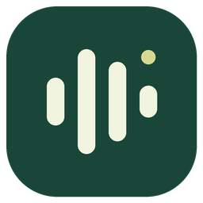
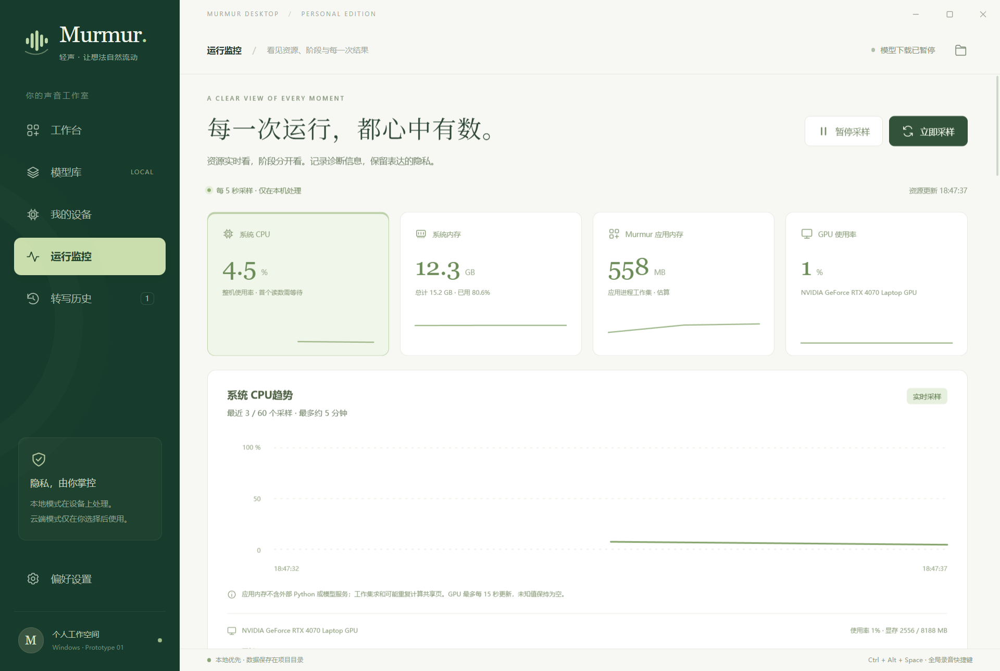

# Murmur · 轻声

一个 Windows 语音输入桌面原型：按功能选择本地模型或自带 API，在其他应用的输入框中用全局快捷键录音，完成后尝试自动回填文字。



**当前阶段不下载模型。** 已实现录音界面、独立模型配置、真实硬件检测与模型建议、演示流程、历史导出，以及带目标校验的 Windows 自动复制/粘贴。真实本地识别仍需后续准备权重与推理依赖；在线识别需要自行提供兼容 API 和密钥。演示文案始终标注为样例，本地失败不会自动上传云端。

## Windows 启动

在这台开发机器上，双击项目根目录 **`Start-Murmur.cmd`**，或直接运行构建产物 **`dist/Murmur/Murmur.exe`**。关闭窗口会收进系统托盘；托盘菜单可以彻底退出。

开发命令需要 Node.js 22 或更新版本：

```powershell
npm start
npm test
npm run check
npm run smoke
npm run build:native
npm run build:win
```

没有 npm 运行时依赖，无需 `npm install`。桌面运行时从本机已有 Electron 40.2.1 Windows x64 缓存解压到 `runtime/electron/`；找不到完整缓存时明确退出，不自动下载。其他机器可以通过 `MURMUR_ELECTRON_ZIP` 指向已有的同版本 ZIP。残缺或版本不符的运行时会报错，原文件保留。

`npm start` 使用系统已有的 .NET Framework C# 编译器生成 `runtime/native/Murmur.Input.exe`。编译器不可用时仍可启动桌面界面，并提示使用剪贴板手动粘贴；不会下载编译器。`npm run build:native` 可单独重建助手。开发时修改界面后重新启动即可，无需先生成 Windows 分发包。

`build:win` 会构建并打包原生助手，需要本机已有 .NET Framework 编译环境，以及 Python 3 为 EXE 嵌入图标；助手构建失败会中止打包。只有重绘图标才需要 Pillow。已构建程序的运行需要 Windows 和 .NET Framework 4.x，不需要为了启动再安装 Node.js 或 Python。

Windows 构建是未签名的开发版文件夹，不是安装器。请保留在本项目 `dist/Murmur/` 位置：它通过相对标记定位项目根目录。移动整个项目可以，单独移走 EXE 不受支持。不自动启动、不改系统文件关联。

## 使用

1. 先在工作台点击“体验演示样例”，体验文字编辑、复制和历史。示例不调用麦克风或网络，也不会自动粘贴到其他应用。
2. 在“偏好设置”分别配置语音识别、语音检测和文本润色。
3. 准备好可用模型或 API 后，把光标放在其他应用的输入框中，按下并松开 **Ctrl+Alt+Space** 开始录音，说完后再次按下并松开。最长单段两分钟。
4. 保持原输入框的焦点。完成转写后，应用先复制文字，校验目标仍然可编辑，再发送一次 **Ctrl+V**。不会按回车或发送消息。浮动状态条显示录音、处理与回填结果，不显示转写正文。
5. 在“我的设备”查看实测硬件，在“模型库”查看项目内模型状态和估算建议。
6. 在“运行监控”查看实时资源、各功能配置状态和最近任务的分阶段耗时、失败原因。资源采样可以暂停或手动刷新。

快捷键可以修改，当前采用“按一次开始、再按一次结束”的切换方式。持续按住时会抑制重复按键消息；这不是按住说话、松开结束，也不支持独立 Fn 键。Ctrl+V 及等价写法保留给粘贴操作，不能设置为录音快捷键。原生助手不可用时使用保守去重，过快的连续按键可能被忽略。

工作台麦克风按钮同样可以录音，但不会捕获外部输入框，因此只按“转写后自动复制”设置处理剪贴板。演示和手动润色也不会自动粘贴。正在启动或录音时可点击“取消录音”，不会继续转写。

## 自动回填与隐私

“快捷键录音后自动粘贴”默认开启，可在偏好设置中关闭。此功能始终先复制文字，不受普通“自动复制”开关影响；关闭自动粘贴后，自动复制开关决定是否更新剪贴板。

原生助手检查原窗口、进程和具体输入控件是否仍匹配，并验证剪贴板内容与物理修饰键状态。切换窗口或输入框、目标关闭、密码框、只读控件、管理员程序、无法验证的控件、剪贴板变化或助手异常，都会停止自动粘贴并显示原因。通常可在目标位置手动按 Ctrl+V；如果剪贴板已被其他内容替换，请先从工作台重新复制。

助手不会强行把焦点切回旧窗口，也不读取目标输入框已经输入的文字。目标身份仅保存在当前录音会话内，不写入历史或导出。界面重载、崩溃或应用退出会使原会话失效。关闭主窗口只是隐藏到托盘，不等同于取消正在进行的录音。

历史会保存复制/粘贴结果及原因，导出保留相应状态和警告。“已自动粘贴”表示 Windows 已接受粘贴按键，不代表应用读取并确认了第三方输入框最终显示的内容。不同应用的辅助功能支持不同，无法确认时会采用手动粘贴。

## 三个独立处理环节

| 环节 | 支持方式 | 首次使用要求 |
| --- | --- | --- |
| 语音活动检测 VAD | 内置能量门限 / 关闭 / 本地 Silero ONNX | 内置门限不需要下载；Silero 需本地文件与 onnxruntime |
| 语音转文字 ASR | 本地 faster-whisper / 已运行的 whisper.cpp 服务 / 在线 OpenAI 兼容 API | faster-whisper 需 Python 环境及完整 CTranslate2 模型；API 需有效端点 |
| 文本整理与润色 | 关闭 / 本地 OpenAI 兼容服务 / 在线兼容 API | 本地服务须事先加载文本模型；在线服务需密钥 |

ASR 云端地址填写 API 基础地址，例如 `https://api.openai.com/v1`；模型名按服务商填写。whisper.cpp 通常填写 `http://127.0.0.1:8080`，程序请求 `/inference`。文本润色服务填写类似 `http://127.0.0.1:8081/v1`，程序请求 `/chat/completions`。本地路由只允许 loopback，云端只允许 HTTPS，重定向会被拒绝。

whisper.cpp 和文本润色本地服务由用户启动，模型库选择不会替其加载模型。请将这些外部服务的模型及缓存目录显式设在本项目；本应用无法控制独立服务自身的下载行为。各环节可以混搭：启用云端润色会将文字发到该端点，即使 ASR 使用本地模式。

## 运行监控

系统 CPU、内存和应用进程工作集约每 5 秒采样，保留最近 60 个点；NVIDIA 占用和显存最多每 15 秒查询一次，缺失数据显示未知。应用内存是 Electron 自有进程工作集之和，可能重复计入共享页面，不含外部 Python 和模型服务，不能当作完整推理内存。应用在托盘运行时继续采样，暂停只影响资源采样。

任务监控记录准备麦克风、录音、音频校验、语音检测、转写、润色、回填各阶段的状态和耗时。关闭的步骤不执行；取消、错误、润色回退、回填跳过和异常退出都有独立状态。`data/monitor.json` 最多保留 100 个任务，不保存录音、转写正文、端点、密钥、窗口或进程身份，不上传遥测。资源曲线只保留在内存中。

配置状态不代表服务已连接：监控不会在后台请求云端 API、加载模型或触发下载。真实调用结果在任务记录中查看。详细字段与故障分支见 [监控规格](docs/MONITORING-SPEC.md)。

## 模型与数据必须留在项目内

```text
voice_to_text/
  models/                       # 后续允许下载时，所有模型放这里
    asr/whisper-base/            # model.bin, config.json, tokenizer.json, vocabulary.*
    vad/silero-vad/silero_vad.onnx
    polish/qwen-1.5b/qwen2.5-1.5b-instruct-q4_k_m.gguf
  data/state.json               # 配置、加密密钥、最多 200 条历史
  data/monitor.json             # 最多 100 个不含正文的任务诊断记录
  cache/                        # Electron / Hugging Face / Torch / 临时缓存
  runtime/local_inference.py    # 不联网的可选 Python 推理入口
  runtime/electron/             # 从现有缓存解压的桌面运行时
  runtime/native/Murmur.Input.exe # 本机编译的焦点/粘贴助手
  native/FocusBridge.cs         # 原生助手源码
  dist/Murmur/Murmur.exe        # Windows 构建；包内包含原生助手
```

本项目管理的所有模型都必须位于 `models/`，不会使用 C 盘默认模型缓存。本地推理使用完整路径、`local_files_only=True` 和离线环境变量；本地 tokenizer 缺失会报错，避免推理库补下 tokenizer。模型路径、子进程缓存、临时目录、Electron 数据目录和构建复制都有项目目录约束，拒绝 junction/符号链接逃逸。音频只在内存中处理，不保存原始录音。Key 使用 Windows 用户绑定加密；更换 Windows 用户后需重新输入。

数据、模型、依赖运行时、EXE、录音、日志及凭据都在 `.gitignore` 中，不推送 GitHub。导出只包含历史文字，不包含密钥或配置。历史文字仍属个人数据，请自行选择导出位置。

## 原型边界

实际完成的检查和仍待验收的项目以 [验证记录](docs/TEST-RECORD.md) 为准。自动化桌面检查可使用合成音频、loopback 转写响应与受控 Windows 输入框；这些不等于物理麦克风、真实模型或真实云端服务已验收。

本轮尚未验证真实语音识别准确率、速度、物理麦克风的实际说话链路、faster-whisper/Silero/GGUF 权重加载和 CUDA 推理。硬件读数及模型建议是资源估算，不能代替实际加载结果。本阶段也没有流式转写、按住说话、Fn 专用键、模型下载器、安装器、签名或自动更新。

## 开发资料

界面预览（隔离测试数据，未执行真实模型识别）：



[工作台预览](docs/images/workbench.png) · [任务阶段与中文错误说明](docs/images/monitor-tasks.png)

- [用户目标和硬约束](agent.md)
- [规格、接口与验收清单](docs/SPEC.md)
- [开源项目调研](docs/RESEARCH.md)
- [验证记录及未验证边界](docs/TEST-RECORD.md)
- [运行监控契约](docs/MONITORING-SPEC.md)
- [后续本地模型准备](runtime/README.md)

界面、主进程、IPC、模型适配器和存储按独立模块组织。跨层变更先更新规格，并检查持久化、历史/导出、Windows 路径和失败分支。
